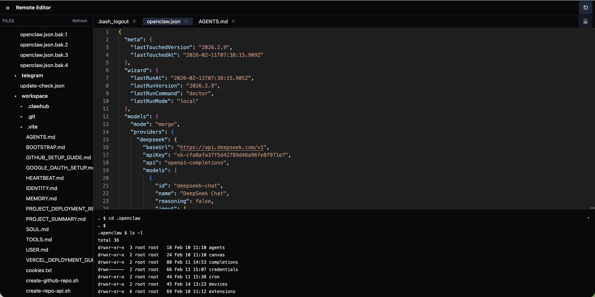
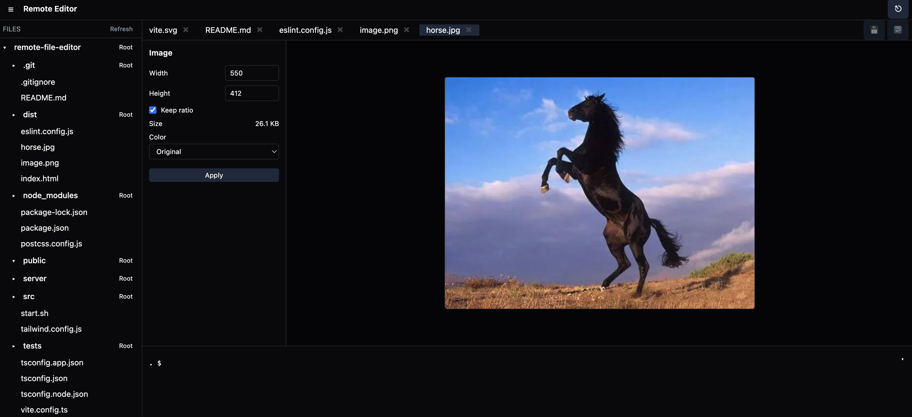

# Remote File Editor



A lightweight web IDE with a VS Code-like layout:
- Monaco-based code editor with syntax highlighting
- File tree browsing, read and save with path safety checks
- Image viewer and simple editor (resize, grayscale, size in bytes)
- Terminal-like panel (API-driven): type after the prompt, results on the next line, prompt reappears
- Terminal panel supports collapse/expand and drag-to-resize
- JWT authentication, password-protected admin access
- Cmd/Ctrl+S to save, unsaved tab close confirmation
- Per-tab revert: discard unsaved changes for text and image files
- Workspace files: save and restore editor state (.workspace)
- All UI text is English with icon-first actions



## Quick Start

1) Configure environment variables (optional) and start

```bash
# optionally create .env in project root:
# ADMIN_PASSWORD=admin
# JWT_SECRET=dev-secret
# WORKSPACE_DIR=/absolute/path/to/your/workspace
# PORT=5174

bash ./start.sh
```

Defaults:
- ADMIN_PASSWORD: admin
- JWT_SECRET: dev-secret
- WORKSPACE_DIR: project directory
- PORT: 5174 (backend) and 5173 (frontend via Vite)

2) Open the app
- Frontend: http://localhost:5173
- Backend: http://localhost:5174

3) Sign in
- Password is ADMIN_PASSWORD (default: admin)

## Features

- Editor
  - Monaco editor, auto layout, word wrap on
  - Language auto-detection by extension
  - Tabs for both text files and images
  - Cmd/Ctrl+S saves current file
  - Per-tab revert restores the last opened/saved version (text and images)

- Image Editor
  - Automatically opens when selecting an image file
  - Shows current image dimensions (width/height)
  - Optional aspect-ratio lock when resizing
  - Grayscale toggle with live preview
  - Displays current image size (bytes/KB/MB) based on the preview
  - Apply button writes the transformed image back to the tab (and can be saved)

- File System
  - Tree view with Refresh
  - Read and save files under WORKSPACE_DIR (path validation enforced)
  - Change directory via terminal using `cd`

- Workspace
  - Workspace files end with `.workspace`
  - Clicking a `.workspace` entry in the file tree does not open an editor tab
  - Instead, it loads a workspace: sets the file-tree root, re-opens listed files, and restores the active tab
  - The "Save WS as" button in the top bar saves the current workspace
    - Always prompts for a workspace file name
    - Stores the file under the backend baseDir (WORKSPACE_DIR), using a relative path
  - Workspace file format:

    ```json
    {
      "rootPath": "relative/path/to/root-or-null",
      "openFiles": [
        "relative/path/to/file-1",
        "relative/path/to/file-2"
      ],
      "activePath": "relative/path/to/file-1"
    }
    ```

- Terminal-like Panel (API Mode)
  - Type after the prompt and press Enter
  - Output appears on the next line; prompt then reappears
  - `cd <dir>` changes working directory
  - `clear` clears the panel
  - Collapse/expand button; draggable height

- Auth
  - POST /api/auth/login with { password }
  - All file and command APIs require the Bearer token
  - Login form supports pressing Enter in the password field to submit

- Tooling
  - `npm run lint` for ESLint
  - `npm run typecheck` for TypeScript project references
  - `npm test` for Vitest-based tests

## API Endpoints

- POST /api/auth/login
  - Body: { "password": "..." }
  - Response: { "token": "..." }

- GET /api/fs/tree
  - Headers: Authorization: Bearer <token>
  - Query: path (optional, relative under WORKSPACE_DIR)

- GET /api/fs/read
  - Headers: Authorization: Bearer <token>
  - Query: path (required, relative)

- POST /api/fs/save
  - Headers: Authorization: Bearer <token>, Content-Type: application/json
  - Body: { "path": "<relative>", "content": "<text>" }

- GET /api/fs/chdir
  - Headers: Authorization: Bearer <token>
  - Query: cwd (relative, current), target (relative)

- POST /api/exec
  - Headers: Authorization: Bearer <token>, Content-Type: application/json
  - Body: { "cmd": "<command>", "args": [], "cwd": "<relative>" }
  - Notes: `shell: true`; returns full stdout/stderr combined

## Manual Start (alternative)

```bash
export ADMIN_PASSWORD=admin
export JWT_SECRET=dev-secret
export WORKSPACE_DIR="$PWD"
export PORT=5174
npm install
npm run dev
```

Frontend: http://localhost:5173  
Backend: http://localhost:5174

## Production Deployment

The app runs as two pieces in production:
- Static frontend built into dist
- Node.js API server (Express) on a separate port

You can front both with a reverse proxy (recommended).

### 1) Build frontend

```bash
git clone <this-repo>
cd remote-file-editor
npm ci
npm run build
# The build output is in ./dist
```

### 2) Run the API server as a service

Set environment variables to lock down access and scope:
- ADMIN_PASSWORD: required to sign in
- JWT_SECRET: random long string for token signing
- WORKSPACE_DIR: absolute path you allow editing in
- PORT: API server port (default 5174)

Example with systemd (Linux):

```ini
# /etc/systemd/system/remote-file-editor.service
[Unit]
Description=Remote File Editor API
After=network.target

[Service]
Type=simple
WorkingDirectory=/opt/remote-file-editor
Environment=ADMIN_PASSWORD=change-me
Environment=JWT_SECRET=$(openssl rand -hex 32)
Environment=WORKSPACE_DIR=/srv/code
Environment=PORT=5174
ExecStart=/usr/bin/node server/index.js
Restart=always
User=www-data
Group=www-data

[Install]
WantedBy=multi-user.target
```

Then:

```bash
sudo systemctl daemon-reload
sudo systemctl enable --now remote-file-editor
sudo systemctl status remote-file-editor
```

Alternative with PM2:

```bash
npm i -g pm2
ADMIN_PASSWORD=change-me \
JWT_SECRET=$(openssl rand -hex 32) \
WORKSPACE_DIR=/srv/code \
PORT=5174 \
pm2 start server/index.js --name remote-file-editor
pm2 save
pm2 startup
```

### 3) Serve the built frontend

Recommended: Nginx serving dist, proxying /api to the Node API.

```nginx
server {
    listen 80;
    server_name example.com;

    root /opt/remote-file-editor/dist;
    index index.html;

    # Serve SPA
    location / {
        try_files $uri /index.html;
    }

    # Proxy API
    location /api/ {
        proxy_pass http://127.0.0.1:5174;
        proxy_set_header Host $host;
        proxy_http_version 1.1;
        proxy_set_header Connection "";
        proxy_read_timeout 300s;
        proxy_send_timeout 300s;
    }
}
```

Reload:

```bash
sudo nginx -t
sudo systemctl reload nginx
```

Alternative quick static server for dist:

```bash
npx serve -s dist -l 8080
# Access http://localhost:8080 and ensure /api points to the API (via reverse proxy or CORS)
```

### 4) Security and ops notes

- Set a strong ADMIN_PASSWORD and JWT_SECRET.
- Restrict WORKSPACE_DIR to a dedicated directory; the API enforces path safety within this root.
- Place the API behind a reverse proxy and TLS (Nginx/Caddy).
- Logs and persistence: keep your process manager configured to restart and persist.
- CORS: the API currently allows cross-origin by default for convenience. Prefer serving the frontend and API under the same domain to avoid CORS entirely.
